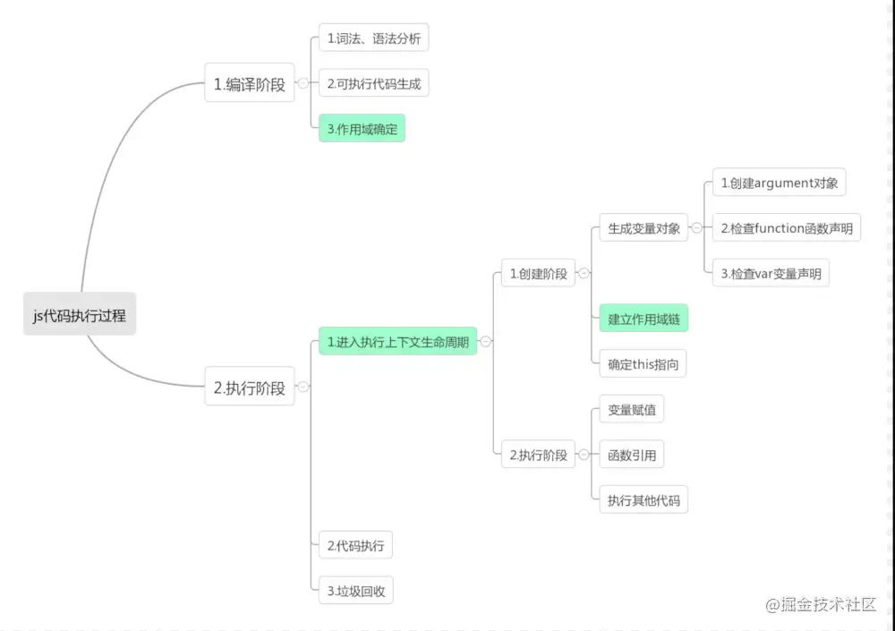

# js

- 执行过程
- 宿主环境
- 数据类型
- 堆栈
- 闭包
- 变量提升
- 类型转换（强制/隐式）
- 类型判断
- 深浅复制
- （尾）递归
- 原型链
- 继承方式
- 作用域（函数作用域，块作用域，词法作用域）
- 设计模式
- call/bind/apply
- ==/===
- 事件队列
- typeof/instanceof
- promise
- 数据结构
- setTimeout/setInterval/requestAnimationFrame
- 垃圾回收机制

## 执行过程

- 编辑
- 执行（解释执行）

编译： 
词法分析-->语法分析--->抽象语法树AST(生成AST过程语法出现错误会报错，eslint原理)

执行:
创建执行上下文-->执行代码-->垃圾回收

执行上下文：
 - 创建阶段: 创建AC（执行上下文）对象，初始化变量/函数，变量提升，确定作用域链/this指向，词法环境

 - 执行阶段: 变量赋值

 ## 宿主环境
 浏览器（JavaScriptCore）/node（v8）

## 数据类型
- 基本数据类型/引用数据类型

基本数据类型:堆
 null/undefined/boolean/number/bigInt/symbol/string

引用数据类型:栈
object/array/function

## 堆（heap）栈（stack）
基础类型存储在stack，引用类型存储在heap，函数执行的时候在stack里面执行，stack保存对heap的地址

## 闭包
一个可以访问function里面变量的function
